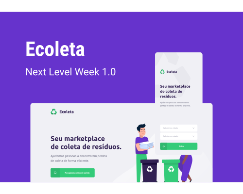

<h1 align="center">
    
</h1>

<p align="center">
  <a href="#-tecnologias">Tecnologias</a>&nbsp;&nbsp;&nbsp;|&nbsp;&nbsp;&nbsp;
  <a href="#-projeto">Projeto</a>&nbsp;&nbsp;&nbsp;|&nbsp;&nbsp;&nbsp;
  <a href="#-layout">Layout</a>&nbsp;&nbsp;&nbsp;|&nbsp;&nbsp;&nbsp;
  <a href="#information_source-como-usar">Como usar</a>&nbsp;&nbsp;&nbsp;|&nbsp;&nbsp;&nbsp;
  <a href="#-como-contribuir">Como contribuir</a>&nbsp;&nbsp;&nbsp;|&nbsp;&nbsp;&nbsp;
  <a href="#memo-licença">Licença</a>
</p>

<p align="center">
 

  
</p>

<br>

<p align="center">
  
</p>

## 🚀 Tecnologias

Esse projeto foi desenvolvido com as seguintes tecnologias:

- [Node.js](https://nodejs.org/en/)
- [React](https://reactjs.org)
- [React Native](https://facebook.github.io/react-native/)
- [Expo](https://expo.io/)

## 💻 Projeto

O Ecoleta é um marketplace que ajuda pessoas a encontrarem pontos de coleta de resíduos de forma eficiente.

<h1 align="center">
    
</h1>

## 🔖 Layout

Você pode visualizar o layout do projeto no formato através [desse link](https://www.figma.com/file/9TlOcj6l7D05fZhU12xWT3/Ecoleta-Booster?node-id=0%3A1). Lembrando que você irá precisar ter uma conta no [Figma](http://figma.com/).

## :information_source: Como usar
Para clonar e executar este aplicativo, você precisará do [Git](https://git-scm.com), [Node.js](https://nodejs.org/en/) e [Yarn](https://classic.yarnpkg.com/en/docs/install/#windows-stable) instalados no seu computador.
Use as linhas de comando:
### Instale na API 
```bash
# Clone esse repositório
$ git clone https://github.com/Xande098/project-nlw-01.git
# Entre no repositório
$ cd Nlw_01/server
# Instale as dependências
$ yarn install
# Execute o Migrates
$ yarn knex:migrate
# Execute as Seeds
$ yarn knex:seed
# Inicie o server
$ yarn dev
# Carregue na porta 3333
```
### Instale no Front-end
```bash
# Clone esse repositório
$ git clone https://github.com/Xande098/project-nlw-01.git
# Entre no repositório
$ cd Nlw_01/web
# Instale as dependências
$ yarn install
# Execute
$ yarn start
# Carregue na porta 3000
```
### Instale no Mobile
```bash
# Clone esse repositório
$ git clone https://github.com/Xande098/project-nlw-01.git
# Entre no repositório
$ cd Nlw_01/mobile
# Instale as dependências
$ yarn install
# Execute
$ yarn start
# O Expo será aberto, basta escanear o qrcode do terminal ou da página do Expo
# Se houver algum problema com as fontes, execute:
$ expo install expo-font @expo-google-fonts/ubuntu @expo-google-fonts/roboto
```

## 🤔 Como contribuir

- Faça um fork desse repositório;
- Cria uma branch com a sua feature: `git checkout -b minha-feature`;
- Faça commit das suas alterações: `git commit -m 'feat: Minha nova feature'`;
- Faça push para a sua branch: `git push origin minha-feature`.

Depois que o merge da sua pull request for feito, você pode deletar a sua branch.

## :memo: Licença

Esse projeto está sob a licença MIT. Veja o arquivo [LICENSE](LICENSE.md) para mais detalhes.

---

#### Feito com muito empenho by Alexandre Sobota

#### Perfil Linkedin: https://www.linkedin.com/in/alexandre-sobota-95839ba2
